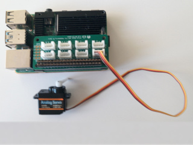

# django-grove
Zintegruj Django z serwomechanizmami i czujnikami z rodziny Grove

## Użyty sprzęt
- Raspberry Pi 4B
- Grove Base HAT for Raspberry Pi Zero
- Grove - Analog servo

## Użyte oprogramowanie
- Python 3.7
- Django 3.2

## Instalacja
Przygotowanie serwera Apache oraz Django przeprowadzić według samouczka dostępnego tutaj:
https://pimylifeup.com/raspberry-pi-django/

## Konfiguracja
Przed uruchomieniem aplikacji należy:
- W pliku /etc/udev/rules.d/90-gpio.rules umieścić linię
> KERNEL=="gpiomem", OWNER="root", GROUP="gpio"
- Użytkownika www-data dodać do grupy gpio
> sudo usermod -a -G gpio www-data
- Django korzysta z arkuszy stylów udostępnianych przez Bootstrap 4 dlatego konieczna jest instalacja pakietu django-bootstrap4
> pip3 install django-bootstrap4
